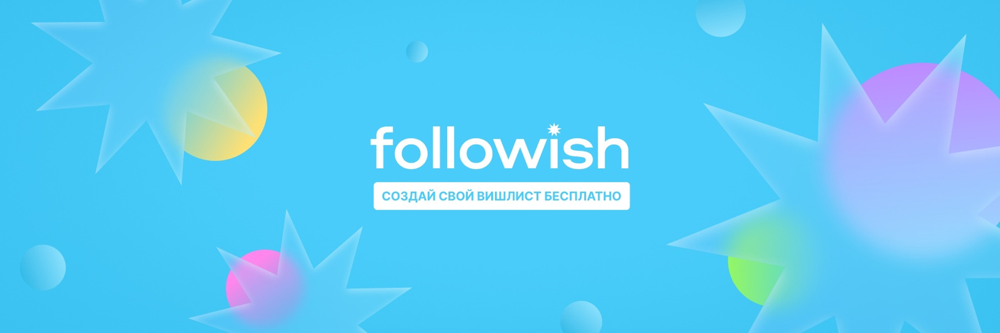
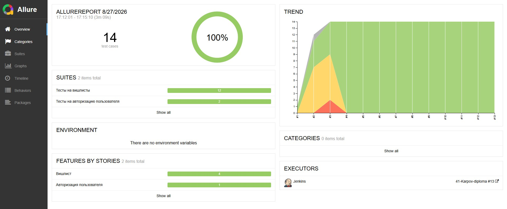
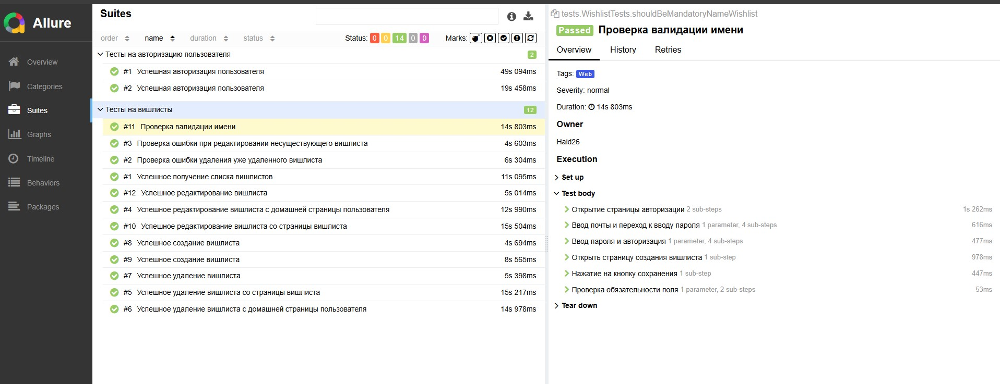
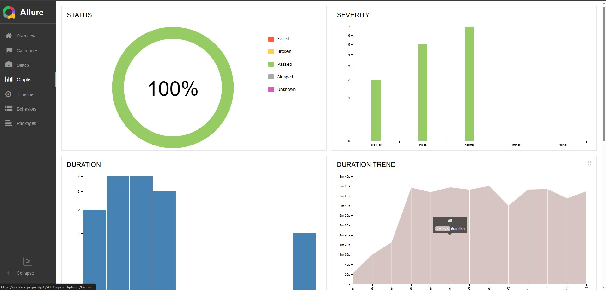
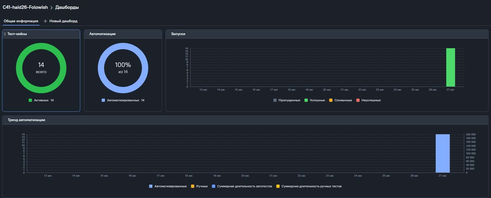
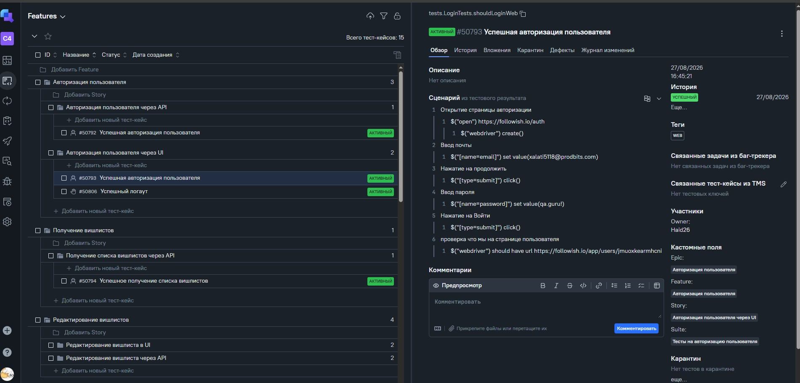
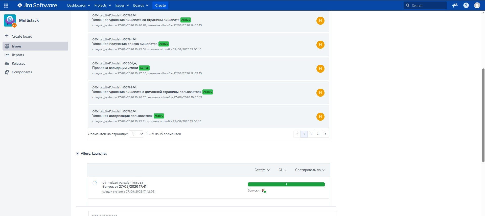
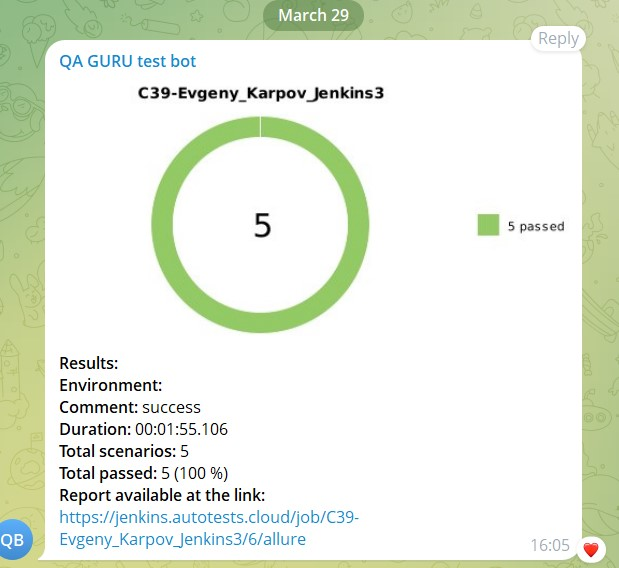

# Проект по автоматизации тестирования для сайта   [Followish](https://followish.io/)
<p align="center">
  
</p>
## **Содержание**
____
* <a href="#tools">Технологии и инструменты</a>

* <a href="#cases">Тестовое покрытие</a>

* <a href="#console">Запуск из терминала</a>

* <a href="#jenkins">Сборка в Jenkins</a>

* <a href="#allure">Allure отчет</a>

* <a href="#testops">Интеграция с Allure TestOps

* <a href="#jira"> Интеграция с  Jira

* <a href="#telegram">Уведомление в Telegram при помощи бота</a>

* <a href="#video">Примеры видео выполнения тестов на Selenoid</a>


<a id="tools"></a>
## Технологии и инструменты

<p align="center">  
<a href="https://www.jetbrains.com/idea/"></a>  
<a href="https://www.java.com/"></a>  
<a href="https://github.com/"></a>  
<a href="https://junit.org/junit5/"></a>  
<a href="https://gradle.org/"></a>  
<a href="https://selenide.org/"></a>  
<a href="https://aerokube.com/selenoid/"></a>  
<a href="https://allurereport.org/"></a> 
<a href="https://qameta.io/"></a>   
<a href="https://www.jenkins.io/"></a>
<a href="https://rest-assured.io/"></a>
<a href="https://www.atlassian.com/software/jira"></a>

</p>

<a id="cases"></a>
## Тестовое покрытие

> Разработаны автотесты на <code>UI</code> и <code>API</code>

### UI

- [x] Тестирование входа на сайт
- [x] Создание нового вишлиста
- [x] Проверка на обязательность имени вишлиста при создании
- [x] Редактирование вишлиста со страницы вишлиста
- [x] Редактирование вишлиста с домашней страницы пользователя
- [x] Удаление вишлиста со страницы вишлиста
- [x] Удаление вишлиста с домашней страницы пользователя

### API

- [x] Тестирование авторизации
- [x] Создание нового вишлиста
- [x] Получение списка всех вишлистов пользователя
- [x] Редактирование вишлиста
- [x] Удаление вишлиста
- [x] Редактирование несуществующего вишлиста
- [x] Удаление уже удаленного вишлиста

<a id="console"></a>
##  Запуск тестов из терминала

### Локальный запуск:
```
gradle clean test
```

<a id="jenkins"></a>
## </a><a name="Сборка"></a> Сборка в [Jenkins](https://jenkins.qa.guru/view/java-students/job/41-Karpov-diploma/)</a>

### **Параметры сборки в Jenkins:**

- *browser (браузер, по умолчанию chrome)*
- *browserVersion (версия браузера, по умолчанию 100.0)*
- *browserSize (размер окна браузера, по умолчанию 1920x1080)*
- *baseUrl (адрес тестируемого веб-сайта)*
- *remoteUrl (логин, пароль и адрес удаленного сервера Selenoid)*
- *apiUrl (эндпоит апи сервера)*

<a id="allure"></a>
## </a><a name="Сборка"></a> [Allure отчет](https://jenkins.qa.guru/view/java-students/job/41-Karpov-diploma/13/allure)</a>

### *Основная страница отчёта*

<p align="center">  
  
</p>

### *Тест-кейсы*

<p align="center">  
  
</p>

### *Графики*

  <p align="center">  


<a id="testops"></a>
## </a><a name="Сборка"></a> Интеграция с [Allure TestOps](https://allure.qa.guru/project/5369/dashboards)</a>

### *Дашборд*

<p align="center">  
  
</p>

### *Тест-кейсы*

<p align="center">  
  
</p>

<a id="jira"></a>
## </a><a name="Сборка"></a> Интеграция с [Attlassian Jira](https://jira.qa.guru/browse/MUL-43)</a>
____
<p align="center">  
  
</p>

<a id="telegram"></a>
## </a> Уведомление в Telegram при помощи бота

> По результатам каждого прогона тестов в Jenkins отправляется сообщение в Telegram. Сообщение содержит информацию о прогоне, а также диаграмму со статистикой прохождения тестов.

<p align="center">  
  
</p>

<a id="video"></a>
## </a> Примеры видео выполнения тестов на Selenoid
____
<p align="center">
  
</p>